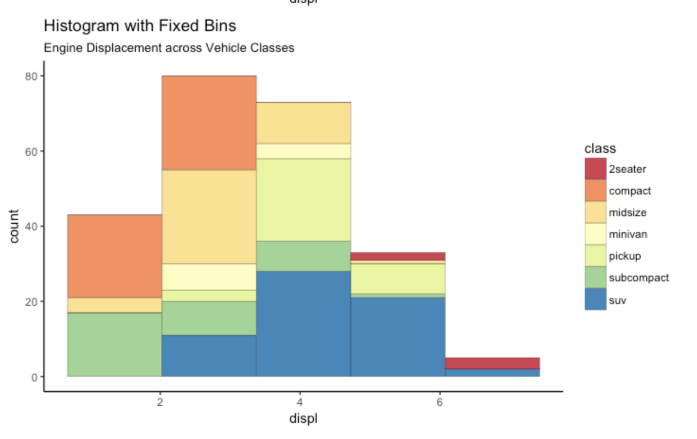
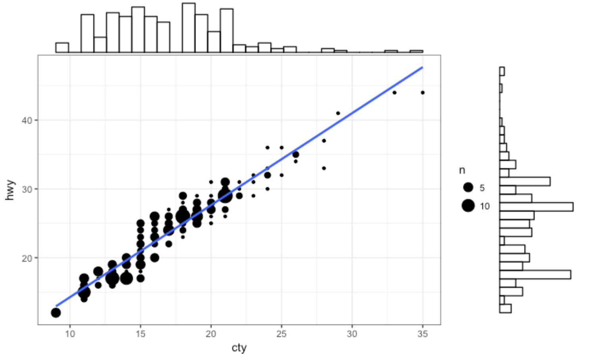
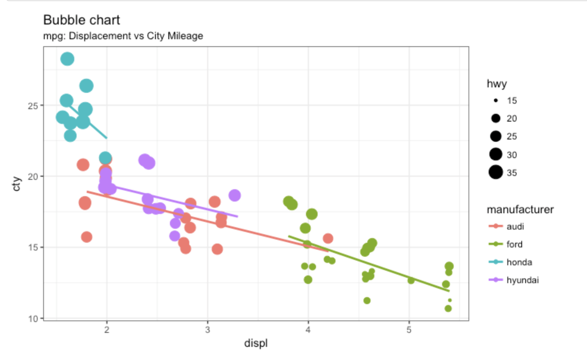
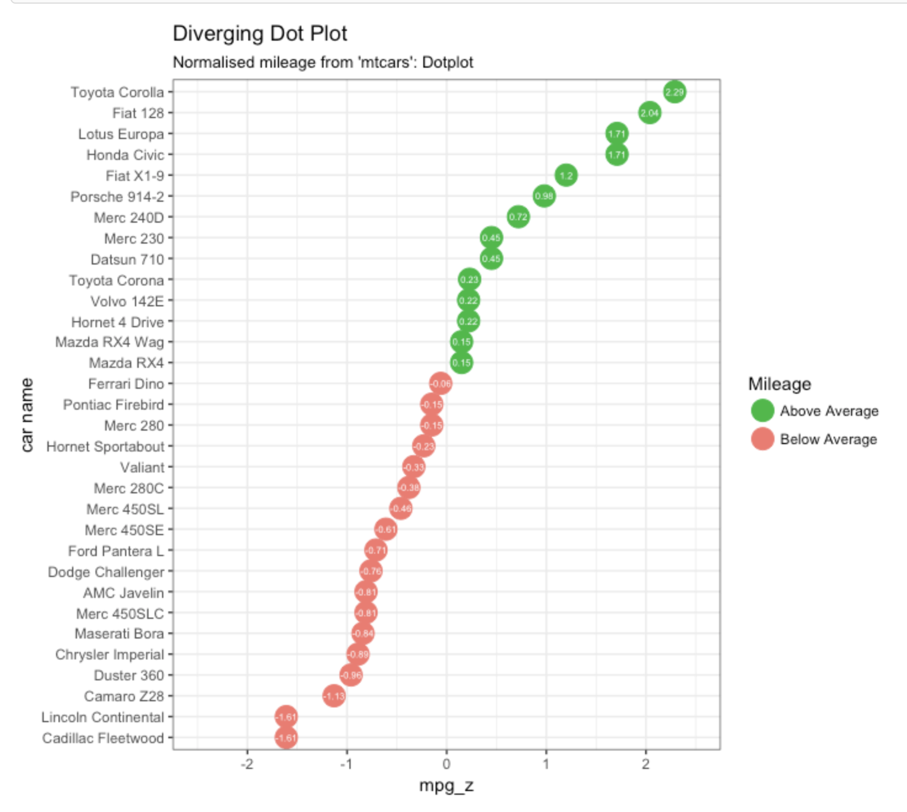

Look at the graphs below. Given the data, do your best to recreate the graph. At times, you may need to manipulate data using dplyr.

```{r}
# packages
library(ggplot2)
library(ggExtra)
library(dplyr)
library(tidyverse)
library(RColorBrewer)
df <- mpg
```


## Graph 1: Histogram with fixed bins and distribution (5 points)

* no need to import a dataset. Call `mpg` as your dataset within ggplot2 (pre-loaded)



```{r}
p1 <- ggplot(df) + geom_histogram(aes(x=displ, fill=class), color="gray", bins=5)+ labs(title='Histogram with Fixed Bins', subtitle='Engine Displacement across Vehicle Classes')+ scale_fill_brewer(palette="Spectral")+ theme_classic()
p1
```

## Graph 2: Marginal Histogram (5 points)

* use the pre-load `mpg` dataset again
* will need to use the `ggExtra` package


```{r}
head(df)
p3<-ggplot(df, aes(x=cty, y=hwy)) + geom_count()+ geom_smooth(method = "lm", se = FALSE) + theme_bw()
ggMarginal(p3, type = "histogram", col="black", fill="white")
```

## Graph 3: Bubble Chart (5 points)
* note the filtering on manufacturer



```{r}
p3 <- df[df$manufacturer %in% c('audi', 'ford', 'honda','hyundai'),] %>% ggplot(aes(x=displ, y=cty, color=manufacturer)) + geom_point(aes(size=hwy))+geom_smooth(method = "lm", se = FALSE)+labs(title='Bubble chart', subtitle='mpg: Displacement vs City Mileage')+ theme_bw()
p3
# It looks like my data is slightly different? But I think aesthetically I'm good?
```

## Graph 4: Diverging Dot Plot (5 points)

* use mtcars from base r
* will need to calculate and z-score and bin cars based on results. 


```{r}
```
```{r}
mean(mtcars$mpg)
sd(mtcars$mpg)
(mtcars$mpg - 20.09062)/6.026948
```

```{r}
# zscore
mtcars$car_name <- rownames(mtcars)
mtcars$mpg_z_score = round((mtcars$mpg - 20.09062)/6.026948, 2)

```

```{r}
#Sorting/ adding mileage flag
mtcars$Mileage <- ifelse(mtcars$mpg_z_score < 0, "Below Average", "Above Average")
mtcars <- mtcars[order(mtcars$mpg_z), ]
mtcars$car_name <- factor(mtcars$car_name, levels = mtcars$car_name)

#graph
p4<-ggplot(mtcars, aes(x=car_name, y=mpg_z_score, label=mpg_z_score)) + geom_point(stat='identity', aes(col=Mileage), size=6) +
scale_color_manual(name="Mileage", values = c("Above Average"="#00ba38", "Below Average"="#f8766d")) +
geom_text(color="white", size=2) +
labs(title="Diverging Dot Plot", subtitle="Normalized mileage from 'mtcars': Dotplot") + ylim(-2.5, 2.5) +
coord_flip()+ theme_bw()

p4
```

